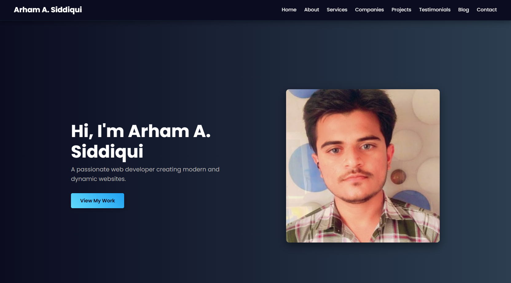
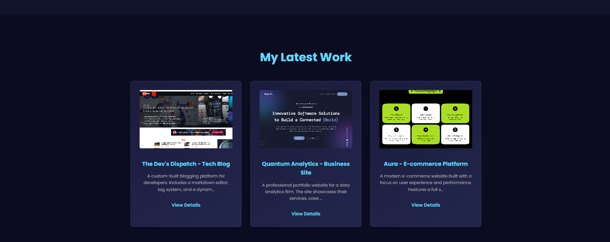
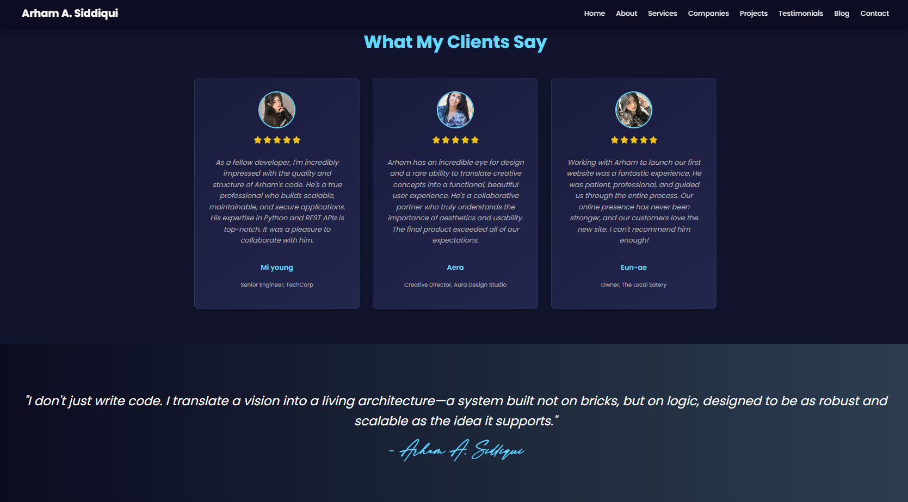
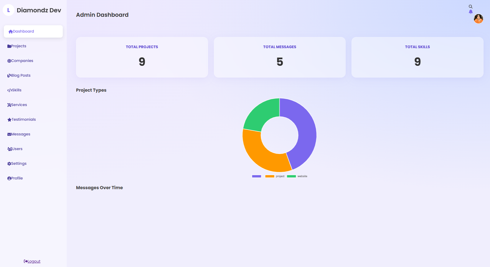
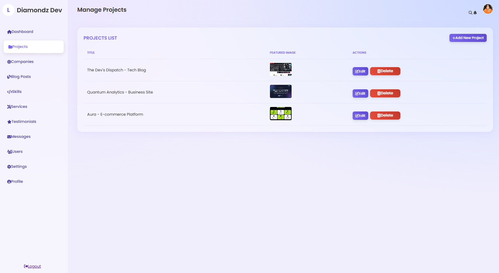

# Arham's Professional Portfolio & Custom CMS

This is a personal portfolio website built from the ground up with a custom, secure, and feature-rich Content Management System (CMS) in the backend. The entire platform is designed to be a professional showcase of web development skills, managed through a private admin panel.

**Live Demo:** [bhavyainst.in](http://bhavyainst.in)

## Screenshots

*(You can add your own screenshots here. I recommend one of the frontend and one of the admin dashboard.)*
**Frontend Screenshots:**
**Hero Section:**

**My Projects:**

**Testimonials:**

**Admin Panel:**
**Admin Dashboard:**

**Add Projects Section:**

## Features

### Frontend (Public-Facing Website)
- **Dynamic Content:** All content, including the hero section, skills, services, projects, companies, and testimonials, is dynamically loaded from the database and managed via the admin panel.
- **Modern UI/UX:** A clean, professional, dark-themed design with smooth scroll animations and gradient text effects.
- **Responsive Design:** The layout is fully responsive and optimized for mobile, tablet, and desktop screens.
- **Contact Form:** A functional contact form that saves messages to the database and triggers real-time notifications in the admin panel.

### Backend (Admin Panel)
- **Secure User Authentication:** A robust login system with password hashing (`password_hash`) to protect user credentials.
- **Role-Based Access Control (RBAC):** Critical pages like "Manage Users" and "Settings" are restricted to users with an 'admin' role.
- **Professional Dashboard:** A central dashboard that displays key statistics and charts using data fetched asynchronously with JavaScript.
- **Full CRUD Functionality:** Complete Create, Read, Update, and Delete capabilities for all major content types:
    - Projects & Companies
    - Blog Posts
    - Skills (with percentage levels)
    - Services
    - Testimonials (with star ratings)
    - Contact Messages
    - Users (Admins & Editors)
- **Secure Actions:** All destructive actions (like delete) are protected against CSRF vulnerabilities using POST requests.
- **Interactive Header:** A functional header with a clickable search bar and a real-time notification system.
- **Site-Wide Settings Management:** A dedicated page to manage global website settings, including SEO meta tags, social media links, and hero section content.
- **User Profile Management:** Users can update their own profile details, including their password (which requires current password verification for security).

## Technology Stack

* **Backend:** PHP
* **Database:** MySQL
* **Frontend:** HTML5, CSS3, JavaScript (using Fetch API for AJAX)
* **Libraries:** Chart.js, Font Awesome

## Local Setup & Installation

To run this project on a local server like XAMPP:

1.  **Prerequisites:**
    * Make sure you have XAMPP (or a similar AMP stack) installed.

2.  **Database Setup:**
    * Export your live database to a `.sql` file from phpMyAdmin.
    * Open your local phpMyAdmin (`http://localhost/phpmyadmin`).
    * Create a new database (e.g., `my_portfolio_cms`).
    * Select the new database and go to the "Import" tab to upload your `.sql` file.

3.  **File Configuration:**
    * Place the project folder (`my_portfolio_cms`) inside your server's root directory (e.g., `C:\xampp\htdocs\`).
    * Open the `includes/db.php` file.
    * Update the database credentials (`$servername`, `$username`, `$password`, `$dbname`) to match your local phpMyAdmin setup (username is typically `root` with no password).

4.  **Run:**
    * Start Apache and MySQL from the XAMPP control panel.
    * Navigate to `http://localhost/my_portfolio_cms/` in your browser.

## Credits

This project was designed and developed by **Arham A. Siddiqui** and is powered by **Diamondz Developers**.

&copy; <?php echo date("Y"); ?> Diamondz Group. All Rights Reserved.
